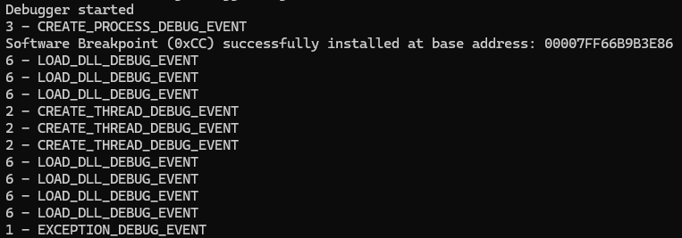
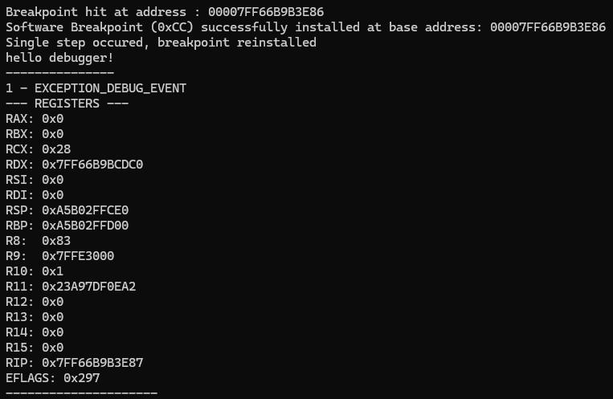

# WindowsX64Debugger

## Requirements
- Visual Studio 2022
- Windows 10/11
- C++20

## Introduction
WindowsX64Debugger is a user-mode debugger for x64 Windows processes built using the Windows Debugging API and C++. 
The project focuses on understanding how debuggers work internally, including debug event handling, process attachment, software breakpoints and
memory modification. The project was developed as a systems programming exercise to gain practical experience with Windows internals and low-level process debugging.

## Features 
- Launch a process under a debugger
- Debug event loop implementation
- Process and thread debug event monitoring
- Software breakpoint using INT3 (0xCC)
- Single-step execution using Trap Flag
- Read and modify process memory
- Clean debugger detach support

## Architecture

*high overview*

- Debugger Class owns the debugger state, process handles, debug events, breakpoint information, and execution flow.
- A Process is launched under the debugger using `CreateProcessA` with `DEBUG_ONLY_THIS_PROCESS`.
- Debug Event Loop waits for debug events using `WaitForDebugEvent`, dispatches them for handling, and resumes execution using `ContinueDebugEvent`.
- installBreakPoint function installs software breakpoints by replacing the first byte of an instruction with `INT3 (0xCC)` and restores the original instruction when the breakpoint is hit.
- printRegisters function gets and displays x64 CPU register state using the Windows `CONTEXT` structure and `GetThreadContext`.
- Single-Step Handler uses the Trap Flag (`TF`) to execute one instruction after restoring the original instruction, then reinstalls the breakpoint.

## Resources

-  https://learn.microsoft.com/en-us/windows/win32/api/processthreadsapi/nf-processthreadsapi-createprocessa
-  https://learn.microsoft.com/en-us/windows/win32/api/debugapi/nf-debugapi-debugactiveprocess
-  https://learn.microsoft.com/en-us/windows/win32/api/debugapi/nf-debugapi-debugactiveprocessstop
-  https://learn.microsoft.com/en-us/windows/win32/api/debugapi/nf-debugapi-waitfordebugevent
-  https://learn.microsoft.com/en-us/windows/win32/api/debugapi/nf-debugapi-continuedebugevent
-  https://learn.microsoft.com/en-us/windows/win32/api/memoryapi/nf-memoryapi-readprocessmemory
-  https://learn.microsoft.com/en-us/windows/win32/api/memoryapi/nf-memoryapi-writeprocessmemory
-  https://learn.microsoft.com/en-us/windows/win32/api/memoryapi/nf-memoryapi-virtualprotectex
-  https://learn.microsoft.com/en-us/windows/win32/api/processthreadsapi/nf-processthreadsapi-flushinstructioncache
-  https://learn.microsoft.com/en-us/windows/win32/api/processthreadsapi/nf-processthreadsapi-openthread
-  https://learn.microsoft.com/en-us/windows/win32/api/processthreadsapi/nf-processthreadsapi-getthreadcontext

## Screenshots

